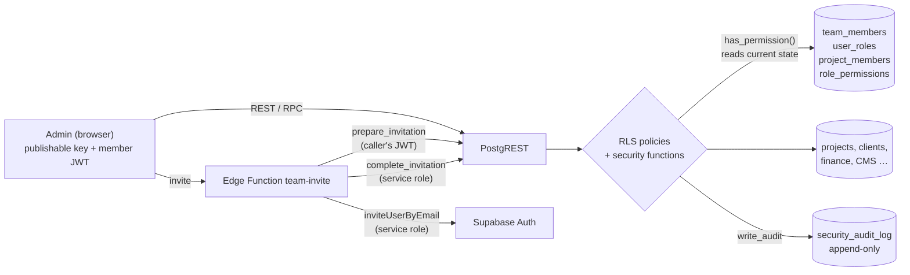
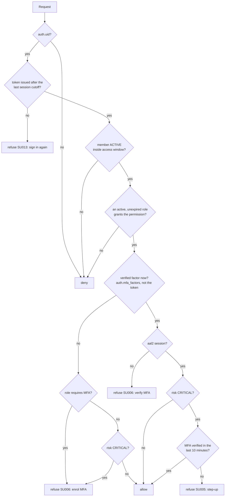
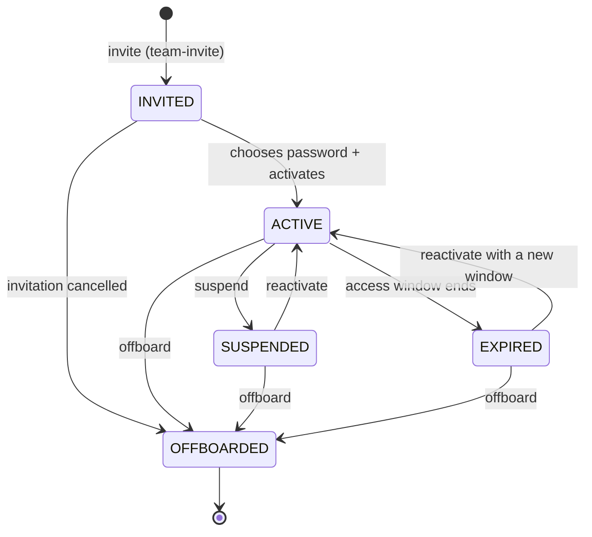
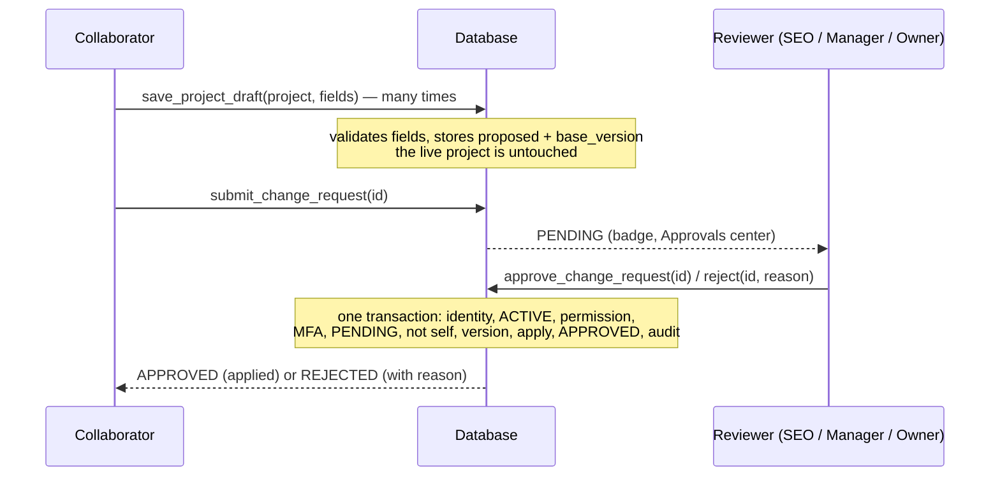

# Admin security architecture

How the Space Underground Admin decides who gets in, what each person may do,
how changes are reviewed, and what is recorded. The short version:

- **Supabase Auth** says *who* someone is (email, their own password, TOTP).
- **The database** says *what they may do*, on every request, from the
  member's current status, roles, project grants and MFA. Nothing about
  authorization lives in the JWT or in anything the browser sends.
- **The Admin** only mirrors that answer to decide what to show. Editing the
  page in DevTools changes the page, not the answer.

Everything described here lives in
[`supabase/migrations/20260928200000_security_rbac_approval_foundation.sql`](../supabase/migrations/20260928200000_security_rbac_approval_foundation.sql)
(**not applied yet**, see [Applying the migration](#applying-the-migration)),
[`supabase/functions/team-invite/`](../supabase/functions/team-invite/) and
[`admin/src/security/`](../admin/src/security/).



## Contents

1. [Authentication](#authentication)
2. [Identity and the RU](#identity-and-the-ru)
3. [Roles](#roles)
4. [Permissions](#permissions)
5. [Row level security](#row-level-security)
6. [Project access](#project-access)
7. [Account lifecycle](#account-lifecycle)
8. [Sessions and token revocation](#sessions-and-token-revocation)
9. [MFA and step-up](#mfa-and-step-up)
10. [Approval workflow](#approval-workflow)
11. [Risk model](#risk-model)
12. [Audit logging](#audit-logging)
13. [Suspension](#suspension)
14. [Offboarding](#offboarding)
15. [Critical operations](#critical-operations)
16. [Bootstrap and break-glass](#bootstrap-and-break-glass)
17. [The Admin's side](#the-admins-side)
18. [HTTP security headers](#http-security-headers)
19. [Rate limiting](#rate-limiting)
20. [Threat model](#threat-model)
21. [Applying the migration](#applying-the-migration)
22. [Verify after applying](#verify-after-applying)
23. [Hardening notes](#hardening-notes)
24. [Known limitations](#known-limitations)

## Authentication

Supabase Auth is the only authentication. The Admin signs people in with
`signInWithPassword` (email and **their own** password) and, when their
account has a verified factor, a TOTP code (`mfa.challengeAndVerify`). There
is no other login, no shared account, no master password and no bypass.

- **Invite-only.** There is no sign-up screen. People join through an
  invitation (see [Account lifecycle](#account-lifecycle)); they choose their
  password from the link Supabase emails them, and nobody else ever knows it.
- **Signing in is not being let in.** After Supabase Auth accepts the password,
  the Admin asks the database `public.my_access()`. An account that is not a
  member is signed straight back out. A member who is suspended, expired,
  offboarded, still invited or who owes MFA stays signed in and sees a screen
  explaining why, and nothing else.
- **Password recovery** is `resetPasswordForEmail`. The sign-in screen always
  answers the same sentence, so it never reveals which addresses exist.
- **No CPF** or any other personal document takes part in authentication or
  identity. None is stored.

Manual settings in the Supabase dashboard (Authentication), all **blocking**
before the deploy (see `docs/release-checklist.md`):

| Setting | Value | Why |
| --- | --- | --- |
| Allow new users to sign up | **off** | Invitations are the only way in. |
| Multi-factor → TOTP | enabled (default) | MFA for privileged roles. |
| Redirect URLs | the Admin's URL | Invitation and recovery links land on `#/welcome`. |
| Leaked password protection | **on** | Refuses passwords known from breaches (the Security Advisor reports it off today). |
| JWT expiry and sessions | 3600 s or less; refresh token rotation on | Bounds how long a token lives unnoticed; a revoked, suspended or offboarded member's token authorizes nothing anyway (session cutoff). |
| Custom SMTP | recommended | The built-in sender allows only a few emails per hour. |

## Identity and the RU

`public.team_members` holds one row per person with Admin access, keyed by
`auth.users.id`. That uuid is the real identity: every grant, request and
audit line points at it.

The **RU** (`SU-00001`, `SU-00002`, …) is the human-facing identifier:

- automatic, from a sequence nobody but the database can draw from;
- unique, immutable (a trigger refuses any change, even from the table
  owner), never reused;
- derived from nothing personal (not CPF, email, phone or birth date);
- not a secret and never used for authorization.

The width grows past `SU-99999` instead of truncating.

## Roles

| Role | Rank | MFA | Meant for |
| --- | --- | --- | --- |
| `ABSOLUTE_ADMIN` | 100 | required | Break-glass only: roles, permissions, security settings. Not a daily account. |
| `OWNER` | 80 | required | The owners' daily accounts: everything except the four absolute-only permissions. |
| `SEO` | 60 | required | Content, CMS, SEO and publishing; reads clients; approves changes. |
| `MANAGER` | 60 | required | Projects, clients and the pipeline; approves changes; reads the team. |
| `COLLABORATOR` | 30 | optional | Assigned projects only: drafts and uploads, never publishing. |
| `VIEWER` | 10 | optional | Assigned projects, read-only. |

A member may hold several roles (Pedro: `SEO` + `OWNER`). **Rank** drives
anti-escalation: nobody acts on themselves, and nobody manages a member whose
highest rank is equal to or above their own — so owners cannot suspend or
demote each other; only an `ABSOLUTE_ADMIN` can, with step-up.

## Permissions

52 permissions over the modules that exist, each with a risk level. The
catalog is [`admin/src/security/catalog.js`](../admin/src/security/catalog.js);
the migration seeds the same rows, and
`admin/tests/security-catalog.test.mjs` fails if they ever differ.

| Module | Permissions (risk) |
| --- | --- |
| projects | `read` L, `read_assigned` L, `create` M, `edit` M, `draft` L, `publish` M, `archive` M, `delete` H |
| files | `read` L, `upload` L, `delete` H |
| clients | `read` L, `create` M, `edit` M, `archive` M, `delete` H |
| commercial | `read` L, `edit` M, `delete` H |
| services | `read` L, `edit` M |
| cms / seo | `cms.read` L, `cms.edit` M, `seo.read` L, `seo.edit` M |
| finance | `read` L, `edit` H, `delete` H |
| logs / settings | `logs.read` L, `settings.read` L, `settings.edit` M, `data.export` H |
| approvals | `read` L, `read_all` L, `request` L, `approve` M, `reject` M |
| team | `team.read` L, `team.invite` H, `team.edit_access` H, `team.suspend` H, `team.offboard` H, `sessions.revoke` H |
| roles | `roles.read` L, `roles.manage` C, `permissions.read` L, `permissions.manage` C |
| audit / security | `audit.read` L, `audit.read_all` M, `security.read` L, `security.manage` C, `critical_settings.manage` C |

Per role: `ABSOLUTE_ADMIN` 52, `OWNER` 48 (all but the four CRITICAL ones),
`MANAGER` 28, `SEO` 26, `COLLABORATOR` 7, `VIEWER` 4. Default deny: anything
not granted is refused. Per-user extra permissions were left out on purpose:
roles combine, and one more table of exceptions is one more place for access
to hide.

### How a request is decided



That is `public.has_permission(key)`: `SECURITY DEFINER`, `search_path`
pinned, evaluated once per statement inside policies (`(select …)`).
`public.require_permission(key)` raises the reason instead: `42501` not
allowed, `SU013` session ended, `SU006` finish MFA, `SU005` step-up.

Error codes of the security functions:

| Code | Meaning |
| --- | --- |
| `42501` | not allowed |
| `SU001` | version conflict: the project changed since the draft |
| `SU002` | self-approval |
| `SU003` | invalid state (the request moved on) |
| `SU004` | invalid input (field not allowed, bad value) |
| `SU005` | step-up required |
| `SU006` | MFA required on this session |
| `SU007` | rate limited |
| `SU008` | member state does not allow it |
| `SU009` | rank (self, or someone at or above you) |
| `SU010` | not found |
| `SU011` | expired |
| `SU012` | requester no longer active |
| `SU013` | this session was ended (revoked, suspended, offboarded): sign in again |

## Row level security

Every table in `public` has RLS on. Every policy that used the old binary
`is_admin()` is replaced by a permission check (`security-surface.test.mjs`
fails if one survives). Nothing calls `is_admin()` any more — no policy,
function, view, constraint, Admin code, Edge Function or service — so no API
role may execute it (`anon`, `authenticated` and `service_role` all lost
`EXECUTE`). It is redefined to fail closed (active `OWNER` or `ABSOLUTE_ADMIN`
with a current token and MFA in order) in case an internal caller ever
appears.

| Table | anon | SELECT (authenticated) | INSERT | UPDATE | DELETE |
| --- | --- | --- | --- | --- | --- |
| `projects` | published + visible, public columns only | `projects.read`, or an assigned project | `projects.create` (+ `publish` if created published) | `projects.edit`; status changes need `publish` / `archive` (trigger) | `projects.delete` |
| `project_gallery`, `project_modules` | of published projects | project access | `projects.edit` | `projects.edit` | `projects.edit` |
| `storage.objects` (project-media) | of published projects | `files.read` + project access | `files.upload` + `projects.edit` or EDIT on that project | `files.upload` + `projects.edit` | `files.delete` |
| `clients` | — | `clients.read` | `clients.create`; the code is assigned by a trigger | `clients.edit`; archiving needs `clients.archive` (trigger) | `clients.delete` |
| `commercial_*` | — | `commercial.read` | `commercial.edit` | `commercial.edit` | `commercial.delete` |
| `financial_transactions` | — | `finance.read` | `finance.edit` | `finance.edit` | `finance.delete` |
| `plans`, `plan_features` | visible plans | `services.read` | `services.edit` | `services.edit` | `services.edit` |
| `site_content` | public | public | `cms.edit` | `cms.edit` | `cms.edit` |
| `site_settings` | public | public | `settings.edit` or `seo.edit`, per column (trigger) | same | `settings.edit` |
| `activity_log` | — | `logs.read`, or your own entries | active member; author forced to the caller | — | — |
| `admins` (legacy) | — | your own row, or `team.read` | refused (trigger) | refused | — |
| `roles`, `permissions`, `role_permissions`, `approval_routes`, `security_settings` | — | active members | — | — | — |
| `team_members`, `user_roles`, `project_members` | — | yourself (with a current token), or `team.read` | — | — | — |
| `team_invitations` | — | `team.read` | — | — | — |
| `change_requests` | — | your own (`approvals.read`); others' once submitted (`approvals.read_all`) | — | — | — |
| `security_audit_log` | — | your events (`audit.read`), everything (`audit.read_all`) | — | — | — |

"—" means no grant at all: the security tables have **no** `INSERT`, `UPDATE`
or `DELETE` grant for `anon`, `authenticated` or even `service_role`. Every
write goes through a `SECURITY DEFINER` function that authorizes the caller
first. The only always-true policies left are the public site's own content
(`site_content`, `site_settings`).

The service role (Edge Functions, the automation service) bypasses RLS as
before; triggers still bump project versions and write the audit log for it.

## Project access

Roles with `projects.read` reach every project. `COLLABORATOR` and `VIEWER`
reach only rows of `public.project_members` (`VIEW` or `EDIT`, optional
`expires_at`, revoked rather than deleted). The check is in the database
(`is_project_member()`), so calling the API directly with another project's
id returns nothing (IDOR). Galleries, modules and media follow the project.

## Account lifecycle



- **Invitation** (`team.invite`, HIGH): the Admin calls the `team-invite` Edge
  Function with the inviter's JWT. The function first runs
  `prepare_invitation` **as the inviter** (permission, rank, step-up for roles
  with approval powers, duplicate email, hourly budget), then
  `auth.admin.inviteUserByEmail` with the service role, then
  `complete_invitation` (service role only) which creates the member
  (`INVITED`), their roles and projects. An auth user that already has a
  password was not created by this invitation (a sign-up from before), so it
  is refused: whoever chose that password could otherwise use the access.
- **Activation**: the invited person opens the email link, which lands on
  `#/welcome`; they choose their password, then `activate_my_membership()`
  moves them to `ACTIVE`. The database refuses activation without a password.
- **Temporary access**: `access_starts_at` / `access_expires_at` on the member
  and `expires_at` on each project grant are enforced by `has_permission()`
  the moment they pass. `expire_stale_access()` (run when the Team screen
  opens, or by a scheduled job) also writes the `EXPIRED` status and expires
  pending requests.
- **History** is never deleted: roles and project grants are revoked with a
  timestamp, the member row stays, `team_members.user_id` references
  `auth.users` with `on delete restrict`.

## Sessions and token revocation

A Supabase access token stays valid until it expires, even after its session
is deleted. So ending sessions is not only deleting them:

- `team_members.sessions_valid_after` is the member's session cutoff. Revoking
  sessions (`revoke_member_sessions`), suspending, offboarding, cancelling an
  invitation and "sign out everywhere" (`revoke_my_sessions`) move it to
  `now()`. It only moves forward: a trigger refuses to clear it or move it
  back, even for a plain `UPDATE` by the table owner.
- Every decision about the caller (`has_permission`, `current_member_active`,
  `require_permission`, `my_access`, the own-row policies) checks the token's
  `iat` against the cutoff (`caller_token_current()`). A token issued before
  it authorizes nothing from the next request on; `require_permission` says
  `SU013` and `my_access()` answers `blocked_reason: SESSION_REVOKED` and
  nothing else: no identity, roles, projects, MFA state or settings (its own
  rows are closed to it by RLS as well). A suspended or offboarded member's
  old token gets that same answer; only a current token learns of the
  suspension.
- Reactivating a suspended member does **not** move the cutoff back: an old
  token never authorizes again. Only a new sign-in (a new `iat`) works.
- The auth sessions are also deleted, so no old token can be refreshed.
- `iat` is whole seconds, so a token from the same second as the cutoff is
  refused too (fail closed: signing in again a second later works). This
  relies on Supabase Auth's and Postgres's clocks agreeing to within a second,
  as they do on the same platform.
- The Admin re-reads `my_access()` on navigation when its snapshot is older
  than 15 s, and at once when any request answers `SU013`; the "session
  ended" screen then offers to sign in again.

## MFA and step-up

- **Required** for `ABSOLUTE_ADMIN`, `OWNER`, `SEO` and `MANAGER` (every role
  with approval powers), **from the first use**: there is no grace period,
  migrated owners included. Without a verified factor and an `aal2` session
  their permissions resolve to nothing; the Admin shows the enrolment screen.
- **The factors, not the token**: Supabase Auth keeps `aal2` and the TOTP
  entry of `amr` in an access token after its factor is removed
  (`mfa.unenroll`), until the session is refreshed. So every check reads
  `auth.mfa_factors` as well as the token: a privileged member without a
  verified factor holds nothing whatever the token says, a member with one
  needs an `aal2` session, and step-up (`step_up_satisfied()`) needs a
  verified factor besides a recent `amr` entry. `my_access()` reports
  `MFA_ENROLL_REQUIRED` in that case, and `mfa.step_up` false. After removing
  a factor the Admin refreshes the session (`auth.refreshSession()`) to get
  the `aal1` token at once and shows the enrolment screen, but nothing
  depends on that: the database refuses the old token by itself.
- **No lockout**: enrolling goes through Supabase Auth (`mfa.enroll`,
  `mfa.challengeAndVerify`), which needs no permission of ours, so the
  enrolment screen always works. A person who loses their authenticator is
  recovered by an operator deleting the factor in the Supabase dashboard
  (Authentication → Users); they enrol again at the next sign-in.
- **Enrolled means enforced**: an account with a verified factor on an `aal1`
  session holds nothing until it verifies the code, whatever its role.
- **Step-up**: CRITICAL permissions need an MFA verification younger than
  `security_settings.step_up_max_age_seconds` (600 s), read from the token's
  `amr` claim (Supabase updates the timestamp on every verification). The
  Admin asks for the code when the database answers `SU005` and retries once.
- The TOTP secret lives in Supabase Auth only. The Admin shows the QR code and
  the key once, during enrolment, and never stores or sends them anywhere.
- The database must be able to read `auth.mfa_factors` (the functions run as
  the migration's owner, `postgres`). If it cannot, every permission check
  fails with an error instead of an answer; that is checked before applying
  (see [Applying the migration](#applying-the-migration)).
- The Team list shows each member's state: MFA on, required, or optional
  (from `team_members.mfa_enrolled_at`, recorded by
  `record_mfa_state()` from what Supabase Auth holds, not from the browser).

## Approval workflow



- **Draft ≠ production.** `save_project_draft` writes only to
  `change_requests`. It accepts the columns in `DRAFT_FIELDS` (name, client,
  category, description, status, year, accent, tech stack, poster, project
  URL, presentation fields, coordinates, translations) and validates each
  value server-side; identity, slug, visibility, publication, featured,
  preview, timestamps and version are never draftable. A poster must be an
  image in that project's own folder, or an https address.
- **Publishing** is a flag on the request (`project.publish`); only a reviewer
  with `projects.publish` can approve it.
- **`approve_change_request`**, atomically: validates the reviewer (active,
  `approvals.approve` + `projects.edit` [+ `projects.publish`], MFA), locks the
  request, returns a no-op if it was already approved (double click, retry,
  second reviewer), refuses a request that is not `PENDING`, is expired, or
  whose requester is no longer active, refuses self-approval, locks the
  project and refuses a stale `base_version` (`SU001`), re-validates the
  fields, applies only the allowed columns with a static column list, records
  old → new per field and the new version, and writes the audit entry.
- **Conflicts**: every project update bumps `projects.version` (a trigger owns
  it; a client value is ignored). A conflict leaves the request pending; its
  author re-bases it on the current version (`rebase_change_request`),
  reviews, and submits again.
- **Rejecting** needs a reason; the project does not change.
- Requests expire after `approval_expiry_days` (14). One open request per
  person and project.

## Risk model

| Risk | Examples | Needs |
| --- | --- | --- |
| LOW | edit a draft, upload to an assigned project, read | the permission |
| MEDIUM | publish, archive, edit clients, approve, CMS edits | the permission (+ MFA for privileged roles) |
| HIGH | deletions, finance entries, exports, team access changes | the permission, MFA, and confirmation in the Admin |
| CRITICAL | roles and permissions, security and critical settings, granting or managing an administrative role, acting on an owner | the permission and a **fresh** MFA verification (step-up) |

The same decision is written once for the interface in
[`admin/src/security/policy.js`](../admin/src/security/policy.js)
(`execute`, `confirm`, `step_up`, `request_approval`, `deny`), and enforced by
the database.

## Audit logging

`public.security_audit_log` records, with the actor (id and RU), the target,
the request, the session's `aal` and sanitized metadata:
`LOGIN_SUCCESS`, `MFA_ENROLLED`, `MFA_REMOVED`, `USER_INVITED`,
`INVITATION_CANCELLED`, `INVITATION_FAILED`, `USER_ACTIVATED`,
`USER_SUSPENDED`, `USER_REACTIVATED`, `USER_EXPIRED`, `USER_OFFBOARDED`,
`ROLE_ASSIGNED`, `ROLE_REMOVED`, `PROJECT_ACCESS_GRANTED/CHANGED/REVOKED`,
`ACCESS_UPDATED`, `PERMISSION_CHANGED`, `SESSION_REVOKED`,
`SECURITY_SETTING_CHANGED`, `BOOTSTRAP_GRANT`, `PROJECT_CREATED/UPDATED/
PUBLISHED/UNPUBLISHED/ARCHIVED/DELETED`, `APPROVAL_DRAFTED/REQUESTED/
APPROVED/REJECTED/CANCELLED/EXPIRED/REBASED`.

- **Append-only for the application's roles and normal paths**: no API role
  has `INSERT`, `UPDATE` or `DELETE`, and triggers refuse `UPDATE`, `DELETE`
  and `TRUNCATE` on every normal path, a plain `UPDATE` by the table owner
  included. Administrative infrastructure changes by the database owner, who
  can alter the schema or drop the triggers, are outside this trust boundary.
- **Written by the database only**: `write_audit()` is internal (no API role
  can call it); the project triggers and security functions call it.
- **No secrets**: metadata keys that look like passwords, tokens,
  authorization headers, cookies, CPF, TOTP, service-role or API keys are
  dropped before the insert. The client IP is not recorded (it cannot be
  trusted from the browser).
- **Approvals** keep requester, reviewer, times, action, resource, result,
  reason, the old → new changeset and the applied version, in the request row
  and in the log.
- `LOGIN_FAILURE` is not recorded here: the database never sees a failed
  password, and a browser-reported failure would be both spoofable and an
  unauthenticated write. Supabase Auth's own audit log records failures.
- `LOGIN_SUCCESS` is recorded once per session (`session_id` from the signed
  token), when the Admin calls `record_sign_in()` after signing in.

## Suspension

`suspend_member` (`team.suspend`, reason required): status `SUSPENDED`,
session cutoff moved to now, sessions deleted (refresh tokens go with them),
sign-in banned in Supabase Auth (`auth.users.banned_until`). Every check
reads the current status, so an access token authorizes **nothing** from the
next request on: no reads, no RPC, no approval, no publication.
`reactivate_member` restores the access (and a new end date when the window
had ended; a suspension inside the window keeps its end date) but not the old
tokens: the cutoff stays, so the member signs in again.

## Offboarding

`offboard_member` (`team.offboard`, reason required) is final: status
`OFFBOARDED` (a trigger refuses any way back, a plain `UPDATE` by the table
owner included), every role and project grant revoked, open drafts and
pending requests cancelled, open invitations cancelled, session cutoff moved,
sessions deleted, sign-in banned. The member row, the RU, authorship of past
changes and the audit trail stay.

## Critical operations

- `set_role_permission` (`permissions.manage`, CRITICAL): add or remove one
  permission from a role (never from `ABSOLUTE_ADMIN`, which always holds
  everything).
- `update_security_settings` (`critical_settings.manage`, CRITICAL): step-up
  window, approval and invitation expiry, invitation budget.
- Granting, removing or managing a holder of an administrative role
  (`OWNER`, `SEO`, `MANAGER`, `ABSOLUTE_ADMIN`): step-up.
- Promoting to `ABSOLUTE_ADMIN`: only an `ABSOLUTE_ADMIN` can, with step-up.

## Bootstrap and break-glass

Applying the migration turns every row of `public.admins` into an **OWNER**,
so nobody loses their role. There is no grace period: like every privileged
member, an owner holds nothing until they enable MFA, which the new Admin asks
for at their first sign-in. **Deploy the new Admin before applying the
migration**: the Admin in production today has no enrolment screen. Nobody
becomes `ABSOLUTE_ADMIN` automatically, and `public.admins` stops granting
anything (new rows are refused with a pointer to the Team module).

To create the break-glass account (once, by hand):

1. In Supabase Auth, create a **dedicated** user for it (not an owner's daily
   account), with a long unique password stored in a password manager both
   owners can reach.
2. In the SQL editor (no request JWT, so the function accepts it):

   ```sql
   select public.bootstrap_member('breakglass@your-domain', 'ABSOLUTE_ADMIN', 'Break-glass');
   ```

3. Sign in with it once and enroll TOTP (it holds nothing until then).
4. Sign out. Use it only for roles, permissions, security settings and
   recovery.

`bootstrap_member` refuses any call carrying a JWT (including the service
role), so it cannot be reached through the API. It is also the recovery path
if every administrative account is locked out.

## The Admin's side

The interface mirrors the database; it does not replace it.

- [`access.js`](../admin/src/security/access.js): the snapshot from
  `my_access()` and `can()`, `hasPermission()`, `hasRole()`,
  `hasProjectAccess()`, `requiresApproval()`, `getRiskLevel()`.
- [`policy.js`](../admin/src/security/policy.js): how an action is offered.
- [`gates.js`](../admin/src/security/gates.js): hides controls marked
  `data-requires` when the permission is missing.
- Router: session → access → state screen (suspended, expired, offboarded,
  not started, invited, MFA enrolment, MFA verification) → route permission
  (403) → page. Routes of the Team, Approvals and Audit modules show
  "database update required" until the migration is applied.
- Before the migration, `my_access()` does not exist; the Admin falls back to
  the legacy `admins` row (an OWNER's view) and keeps working as before.
- Invitation and recovery links carry a session in the URL fragment; it is
  read once at boot and removed from the address bar before routing.
- The collaborator dashboard never queries clients, finance, commercial, team
  or logs; the full dashboard skips any module the member cannot read.
- The approvals badge is one head-only count, reused for a minute — no polling.

## HTTP security headers

Set in [`netlify.toml`](../netlify.toml) for every path:

| Header | Value |
| --- | --- |
| Content-Security-Policy | `default-src 'self'; script-src 'self'; style-src 'self' 'unsafe-inline' https://fonts.googleapis.com; font-src 'self' https://fonts.gstatic.com; img-src 'self' data: blob: https:; connect-src 'self' https://*.supabase.co wss://*.supabase.co; frame-src 'self' https:; frame-ancestors 'none'; base-uri 'self'; form-action 'self'; object-src 'none'; upgrade-insecure-requests` |
| Strict-Transport-Security | `max-age=31536000; includeSubDomains` (no `preload`: that is hard to undo) |
| X-Frame-Options | `DENY` |
| X-Content-Type-Options | `nosniff` |
| Referrer-Policy | `strict-origin-when-cross-origin` |
| Permissions-Policy | camera, microphone, geolocation, payment, usb, serial, bluetooth off |
| Cross-Origin-Opener-Policy | `same-origin` |

Why each source is there: the bundle has no inline script; inline style
attributes are used for accent swatches and bars; Google Fonts serves the
typefaces; posters are signed Supabase URLs or https addresses and previews of
a file before upload are `blob:`/`data:`; the project editor frames a
project's own https site. The three Admin e2e suites were run against a build
served with exactly these headers (a violation fails them), and
`security-headers.test.mjs` keeps the policy from being loosened by accident.
Netlify serves HTTPS itself.

## Rate limiting

No client-side limiter pretends to protect anything. What exists:

| Flow | Limit |
| --- | --- |
| Sign-in, password recovery, email sending | Supabase Auth's built-in rate limits (Authentication → Rate Limits). Review them there. |
| Invitations and resends | `security_settings.invitations_per_hour` (20) per inviter, in the database (`SU007`), plus Supabase's email limits. |
| Approvals | Bounded by design: one open request per person and project; approving twice is a no-op. |
| Privileged actions | MFA and step-up; every action is audited. |
| Edge Function | CORS limited to `ADMIN_ALLOWED_ORIGINS`; the database budget above. |

Per-IP throttling of the REST API is not available to this project's code;
it belongs to Supabase's platform limits.

## Threat model

### 1. A collaborator's password is compromised
- **Attack:** someone signs in as the collaborator.
- **Defense:** they reach only the assigned projects, can only draft (never
  publish or approve), cannot see money, clients, team, logs or settings.
  Every action is audited with the RU. The account can be suspended at once;
  the old token stops authorizing anything and refresh fails.
- **Residual risk:** the attacker can read the assigned projects and submit
  misleading drafts until someone notices. Collaborators may enable MFA
  (optional for their role).

### 2. An owner's password is compromised
- **Attack:** someone has an owner's password.
- **Defense:** owners must use MFA from the first use: without the TOTP code
  the account holds nothing, migrated accounts included. CRITICAL actions
  need a fresh code. Owners cannot remove each other; the break-glass account
  can suspend a compromised owner, which ends every token at once.
- **Residual risk:** an attacker with both the password and the TOTP device
  (or a phished code, within its 30 s) gets in until someone suspends the
  account.

### 3. A JWT is stolen
- **Attack:** an access token is copied from a device.
- **Defense:** the token only proves identity; every request re-reads status,
  roles and grants, and checks the token's `iat` against the member's session
  cutoff. Revoking the member's sessions (or suspending or offboarding them)
  makes every token issued so far worthless at once, and a reactivation does
  not bring it back. CRITICAL actions need an `amr` entry younger than 10
  minutes and a factor the member still has: a stolen `aal2` token used to
  remove the factor loses every privileged permission with it. The refresh
  token dies with the session.
- **Residual risk:** until someone revokes the sessions (or the token
  expires), a stolen token works with that member's current permissions.

### 4. JavaScript edited in DevTools
- **Attack:** the attacker unhides buttons, forges the access snapshot, calls
  functions from the console.
- **Defense:** the snapshot only drives the interface. RLS and the security
  functions decide every request; `security-invariants.test.mjs` item 16.
- **Residual risk:** none beyond what the member's real permissions allow.

### 5. Direct calls to Supabase
- **Attack:** REST or RPC calls with the publishable key and the member's JWT,
  bypassing the Admin.
- **Defense:** same RLS and functions as through the Admin. Security tables
  have no write grant at all; internal functions are not executable by API
  roles (`security-surface.test.mjs`).
- **Residual risk:** none beyond the member's permissions.

### 6. A collaborator tries to escalate
- **Attack:** change their own role, user_roles, role_permissions, status or
  expiry; add themselves to a project; mark a request approved; call
  bootstrap or privileged functions; put `role` in metadata or claims.
- **Defense:** no write grants on those tables; every lifecycle function
  refuses self-changes and rank ≥ own; `bootstrap_member` refuses any JWT;
  claims and metadata are never read for authorization (invariants 7, 8, 17).
- **Residual risk:** none known.

### 7. A malicious insider (an owner)
- **Attack:** an owner abuses legitimate access (exports data, deletes
  records, publishes bad content).
- **Defense:** every privileged action is audited and the log cannot be
  edited or deleted by anyone through the API. Owners cannot change roles and
  permissions (absolute-only) or act on the other owner.
- **Residual risk:** an owner is trusted with the business data; the audit
  trail makes misuse visible, it does not prevent it. The database superuser
  (the Supabase platform) can still alter anything.

### 8. An offboarded person keeps a session
- **Attack:** a laptop still has a signed-in tab.
- **Defense:** offboarding sets the status (checked on every request), moves
  the session cutoff (every existing token is refused), deletes the sessions
  and refresh tokens and bans sign-in.
- **Residual risk:** the open tab keeps what it already rendered on screen;
  no new data loads.

### 9. The service role key leaks
- **Attack:** full database access, bypassing RLS.
- **Defense:** the key exists only in Edge Function secrets and the
  automation service's server env; never in the Admin bundle
  (`security-surface.test.mjs` scans the source; the build was checked).
  Even the service role cannot write the security tables or the audit log
  directly.
- **Residual risk:** a leaked service key can read everything and change
  business data. **Response:** rotate it in Supabase (API keys), update the
  Edge Function secrets and the automation service, then review the audit log
  and Supabase's logs.

### 10. A tampered approval request
- **Attack:** a crafted request with forbidden fields, an arbitrary payload,
  another project's poster, or a forged `approved` status.
- **Defense:** only allowed columns, validated server-side on save and again
  on approval; applied through a static column list, never by executing the
  payload; status only moves through the functions; reviewers see the exact
  diff before approving.
- **Residual risk:** a reviewer can still approve bad content they failed to
  read. The diff is shown field by field to make that harder.

### 11. A tampered audit log
- **Attack:** hide traces by updating, deleting or truncating the log.
- **Defense:** no write grant for any API role; triggers refuse update, delete
  and truncate on every normal path, a plain update by the table owner
  included (invariants 14, 15).
- **Residual risk:** the database owner (and the platform's superuser) can
  alter the schema or drop the triggers: that is outside the application's
  trust boundary. Exporting the log periodically to storage outside the
  project would narrow it.

### 12. A malicious draft
- **Attack:** a collaborator proposes scripts in text fields, a
  `javascript:` link, a huge payload, an image from another project.
- **Defense:** length and type limits, http(s)-only URLs, same-project storage
  paths, translations validated; the Admin escapes everything it renders; the
  CSP forbids inline scripts.
- **Residual risk:** an uploaded draft image is stored in the project's folder
  before approval; for a published project, whoever knows its exact path could
  fetch it.

### 13. Replay or double approval
- **Attack:** approve twice, or approve an old draft over newer work.
- **Defense:** row locks; an approved request returns a no-op; a stale
  `base_version` is a conflict (invariants 18, 19).
- **Residual risk:** none known.

### 14. IDOR between projects
- **Attack:** use another project's id in a select, an RPC or a storage path.
- **Defense:** project access is checked in the database for every table,
  function and storage object (invariants 2, 13); drafts can only reference
  the project's own storage folder.
- **Residual risk:** none known.

## Applying the migration

**Not applied.** Applying it is a production change; do it deliberately.

1. Read the migration once more; confirm nothing else is pending:

   ```sql
   select version, name from supabase_migrations.schema_migrations order by version;
   ```

   The newest recorded version must be `20260928035023`.
2. Check who will become OWNER:

   ```sql
   select a.user_id, a.role, u.email from public.admins a join auth.users u on u.id = a.user_id;
   ```

   And that the database can read the MFA factors every permission check
   reads (**blocking**: both must be `true`):

   ```sql
   select has_table_privilege('postgres', 'auth.mfa_factors', 'select'),
          has_schema_privilege('postgres', 'auth', 'usage');
   ```

3. In Supabase Auth settings (all **blocking**, see the release checklist):
   sign-ups **off**; TOTP enabled; the Admin URL in Redirect URLs; leaked
   password protection **on**; JWT expiry and session settings reviewed.
4. **Deploy the new Admin first.** Before the migration it falls back to the
   legacy model and works as today; after it, privileged accounts need MFA
   from their first sign-in and only the new Admin has the enrolment screen.
5. Apply: `supabase db push`, or paste the file into the SQL editor (it runs
   as one script and is safe to run twice).
6. Deploy the Edge Function (needs the Supabase CLI and project access):

   ```bash
   supabase secrets set ADMIN_ALLOWED_ORIGINS=https://<admin host> ADMIN_INVITE_REDIRECT_URL=https://<admin host>/
   supabase functions deploy team-invite
   ```

   `SUPABASE_URL`, `SUPABASE_ANON_KEY` and `SUPABASE_SERVICE_ROLE_KEY` are
   provided by the Edge runtime (REQUIRES VERIFICATION with the new API keys:
   if the legacy JWT keys are disabled, set the service key secret by hand).
7. Both owners: sign in; the Admin opens the MFA enrolment screen; enrol and
   verify.
8. Create the break-glass account ([Bootstrap](#bootstrap-and-break-glass)).
9. Adjust roles in the Team module (for example Pedro: add `SEO`).
10. Optional: schedule `select public.expire_stale_access();` daily (pg_cron).

## Verify after applying

Each of these is REQUIRES VERIFICATION until run against production:

- [ ] `select count(*) from public.team_members;` equals the number of former
      admins; each has `OWNER` in `user_roles`.
- [ ] `select * from public.my_access();` as an owner (via the Admin) shows
      48 permissions and `blocked_reason` null.
- [ ] Session revocation works on this project: suspend a test member, then
      `select count(*) from auth.sessions where user_id = '<id>';` is 0. The
      functions return `sessions_revoked: null` in the audit metadata if the
      platform refuses the delete.
- [ ] Sign-in ban works: the suspended test member cannot sign in
      (`banned_until` set; `sign_in_banned: true` in the audit line).
- [ ] Token revocation works: with a signed-in test member, revoke their
      sessions from the Team screen; their next request is refused (the
      Admin shows "session ended") and a new sign-in works.
- [ ] An authorized member creates a client without a code and gets a
      `CLIENT-…` code; `select public.next_client_code()` through the API is
      refused.
- [ ] `postgres` can read `auth.mfa_factors` (checked before applying, once
      more here): `select count(*) from auth.mfa_factors;` in the SQL editor.
- [ ] Removing MFA takes effect at once: a privileged test member removes
      their factor in Settings and the Admin shows the enrolment screen; a
      request made with the access token they held before the removal is
      refused (`SU006`).
- [ ] As `anon` with the publishable key, `team_members?select=ru&limit=1`
      and `security_audit_log?select=id&limit=1` are refused.
- [ ] The public site still loads published projects (`projects` anon policy
      untouched).
- [ ] An invitation to a test address arrives, the link lands on `#/welcome`,
      choosing a password activates the account, and the audit log shows
      `USER_INVITED` and `USER_ACTIVATED`.
- [ ] Settings → System lists no pending migration.

## Hardening notes

- **Client codes** are assigned by a trigger (`clients_assign_code`) when a
  client is inserted without one. The generator used to be the column
  default, which made it an RPC every signed-in account could call; now no
  API role can execute it, not even the service role, and an insert by
  someone without `clients.create` is refused before a number is drawn.
- **`search_path`** is pinned (`public, pg_temp`) on every function in
  `public`, including those of earlier migrations the Security Advisor flags
  (`touch_updated_at`, `stamp_published_at`, `media_project_id`,
  `valid_i18n_translations`, `stamp_client_archived_at`,
  `stamp_financial_paid_at`, `stamp_commercial_opportunity_stage`).
- **Trusted backends**: `is_trusted_backend()` is always true or false, never
  null. A null would have skipped every guard written as
  `not is_trusted_backend()` for claims without a role.
- **`is_admin()`** has no caller left and no API role may execute it.
- **MFA after a factor is removed** (second review): `mfa_gate()` reads the
  member's verified factors before the token's `aal`, and
  `step_up_satisfied()` needs a verified factor too, so an `aal2` token that
  outlives its factor authorizes nothing a factor was needed for, CRITICAL
  included. `require_permission` answers `SU006` (enrol) rather than `SU005`
  (step-up) when there is no factor to step up with.
- **An ended session's `my_access()`** returns only
  `blocked_reason: SESSION_REVOKED` with empty lists: no member, roles,
  projects, MFA state or settings.

## Known limitations

- **Re-hiring** an offboarded person is not supported: offboarding is final
  and the email stays taken. A returning person needs a manual decision.
- **Deleting a Supabase Auth user** who is a member fails
  (`on delete restrict`) to protect history; offboard instead.
- **Existing accounts with a password** cannot be invited (pre-account
  takeover protection); verify them and use `bootstrap_member` by hand.
- **Draft images** are uploaded to storage before approval (see threat 12).
- **One resource type**: drafts and approvals cover projects. Other modules
  are edited directly by roles that hold their permissions.
- **Tasks** (Tarefas) from the collaborator wishlist do not exist as a module
  and were not invented.
- **Email templates** are Supabase's defaults; customising them (e.g. to use
  `token_hash` links) is optional and supported by the welcome screen.
- The 320 px topbar overflow of the account chip predates this work.
- **Session cutoff precision**: `iat` has whole seconds, so a new sign-in in
  the same second as a revocation is refused too (sign in again). The check
  assumes Supabase Auth's and Postgres's clocks agree within a second.
- **Which factor a token verified** is not in the token: `amr` names the
  method, not the factor. A token from before a factor was removed counts
  again once the member verifies a new factor. The member holds MFA in both
  cases; ending their sessions retires such tokens.
